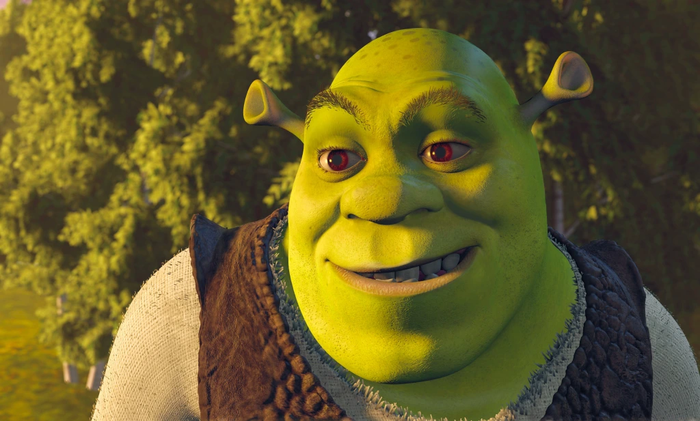
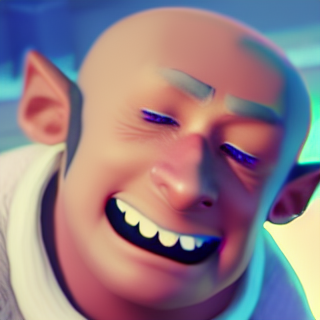
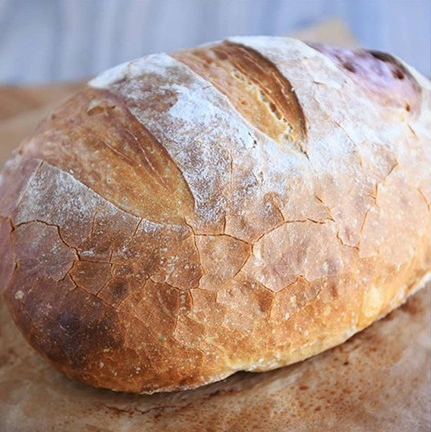
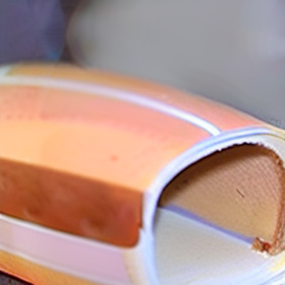

# 1, Stable Diffusion. Solution based on images conditioning (2 / 5)
The code and model are taken from https://huggingface.co/spaces/lambdalabs/image-mixer-demo ([git](https://github.com/justinpinkney/stable-diffusion#image-mixer))

```shell
python solution_img_conditioning.py --device cpu --seed 1100 --steps 30 \
gigachad.jpg shrek.png gigachad_shrek.png
```

The model is a finetuned version of sd-1.5, that's able to receive CLIP image embeddings as conditionings (instead of CLIP text embeddings)

 

=>




 

=>




