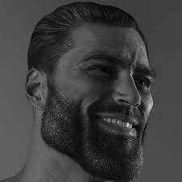

# 1, Stable Diffusion by Lambdalabs. Solution based on images conditioning (2 / 5)
The code and model are taken from https://huggingface.co/spaces/lambdalabs/image-mixer-demo ([git](https://github.com/justinpinkney/stable-diffusion#image-mixer))

```shell
python solution_img_conditioning.py --device cpu --seed 1100 --steps 60 \
gigachad.jpg shrek.png gigachad_shrek.png
```

The model is a finetuned version of sd-1.5, that's able to receive CLIP image embeddings as conditionings (instead of CLIP text embeddings)

Shrek + gigachad:

 

=>


Cat + bread:


 

=>


# 2, Image2text2image. Solution based on images conditioning (1 / 5)

- https://github.com/pharmapsychotic/clip-interrogator is used for generating text prompt by image;
- prompts are combined bax with mixing (`(A, B, C) + (X, Y, Z) => (A, X, B, Y, C, Z)`)
- new image is generated with [SD 2 official base model](https://huggingface.co/docs/diffusers/api/pipelines/stable_diffusion_2)

```shell
python solution_img2text2img.py --device cpu --seed 1200 --steps 60 \
gigachad.jpg shrek.png gigachad_shrek_img2text2img.png
```

Shrek + gigachad:

 

=>


Cat + bread:


 

=>


# 3, Stable Diffusion Reimagine (UnCLIP). Img embeddings averaging (4 / 5)

[UnCLIP](https://huggingface.co/stabilityai/stable-diffusion-2-1-unclip) is a new finetuned version of Stable Diffusion (24.03.2023), that provides a conditioned img2img generation.
In our case, however, I use the following inputs:

- empty (`""`) text prompt as text input;
- averaging image embeddings (`(image1_embeddings + image2_embeddings) / 2`) as image input. 

```shell
python solution_unclip.py --device cpu --seed 1200 --steps 30 \
gigachad.jpg shrek.png gigachad_shrek_unclip.png
```

Shrek + gigachad:

 

=>


Cat + bread:


 

=>


